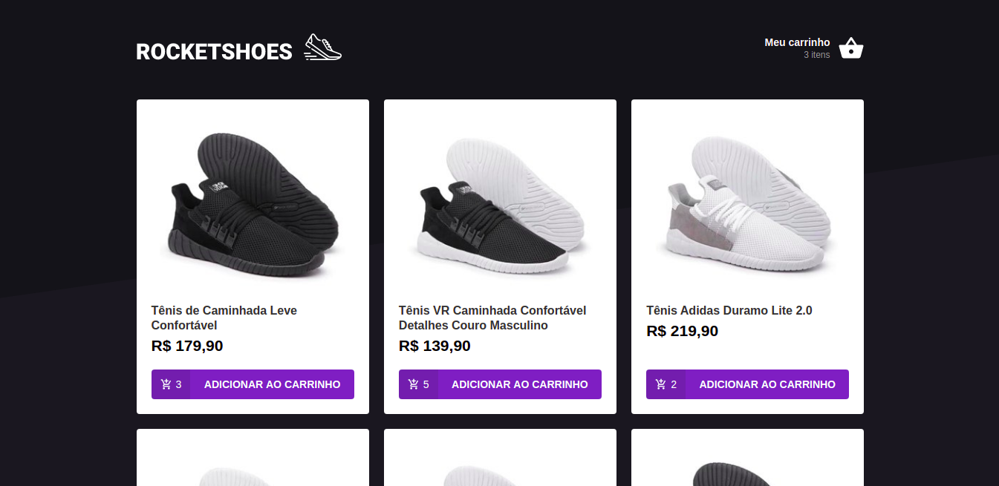
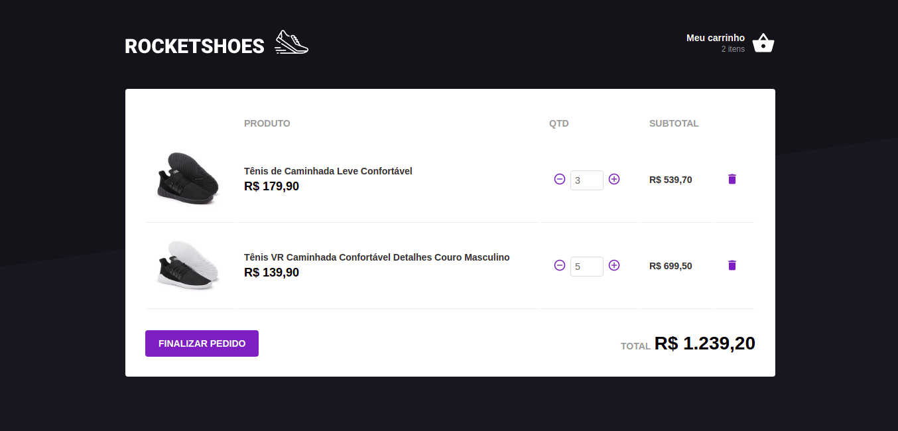

## Projeto

Projeto do front de um e-commerce de calçados utilizando ReactJS.

## Interface

Home 

Cart 

## Como instalar

Esse projeto utiliza o json-server.

### `npm -g install json-server`

Instale o json-server globalmente.

### `json-server server.json -p 3333`

Rode o json-server na porta 3333.

### `yarn start`

Rode o aplicativo em modo de desenvolvimento 
Abra [http://localhost:3000](http://localhost:3000) para ver no navegador.
